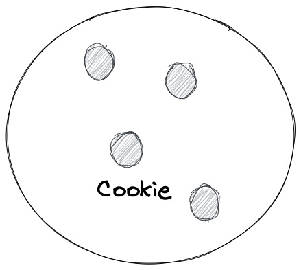

# Cookies are delicious

# Ingredients

* 1 egg
* Lots of butter
* Flour
* Chocolate chips
* Sugar

# Instructions

Throw them in a mixer. Bake for miutes at 350. Eat.

## notes from making them in 2012
If you don't add enough chocolate chips they are not tasty

## notes from making them in 2022
Butter is delicious so is sugar

# heading 1
## heading2
### heading 3

<h1>Hi</h1>
